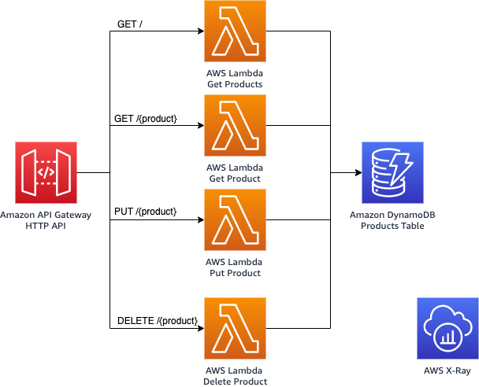
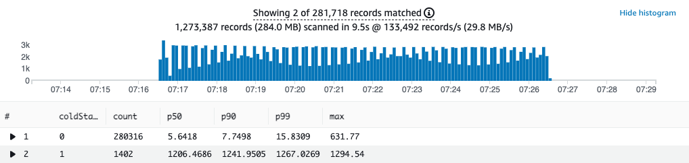

## Serverless Kotlin Demo

[comment]: <> (![build]&#40;https://github.com/aws-samples/serverless-kotlin-demo/actions/workflows/maven.yml/badge.svg&#41;)

<p align="center">
  
</p>

This is a simple serverless application built in Kotlin using the [AWS SDK for Kotlin](https://docs.aws.amazon.com/sdk-for-kotlin/latest/developer-guide/). It consists of an
[Amazon API Gateway](https://aws.amazon.com/api-gateway/) backed by four [AWS Lambda](https://aws.amazon.com/lambda/)
functions and an [Amazon DynamoDB](https://aws.amazon.com/dynamodb/) table for storage.

## Requirements

- [AWS CLI](https://aws.amazon.com/cli/)
- [AWS CDK](https://aws.amazon.com/cdk/)
- Java 11
- Gradle
- [Artillery](https://www.artillery.io/) for load-testing the application

## Software

Within the `software` folder is the Kotlin Gradle project. This single project contains all the code for all four
Lambda functions.

To build the cod run:

```bash
gradle shadowJar
```

## Infrastructure

### Deployment

Deploy the demo to your AWS account using [AWS CDK](https://aws.amazon.com/cdk/).

```bash
cdk deploy
```

CDK will create an output of the API Gateway endpoint URL for future use in our load tests.

## Load Test

[Artillery](https://www.artillery.io/) is used to make 300 requests / second for 10 minutes to our API endpoints. You
can run this with the following command.

```bash
cd load-test
./run-load-test.sh
```

This is a demanding load test, to change the rate alter the `arrivalRate` value in `load-test.yml`.

### CloudWatch Logs Insights

Using this CloudWatch Logs Insights query you can analyse the latency of the requests made to the Lambda functions.

The query separates cold starts from other requests and then gives you p50, p90 and p99 percentiles.

```
filter @type="REPORT"
| fields greatest(@initDuration, 0) + @duration as duration, ispresent(@initDuration) as coldStart
| stats count(*) as count, pct(duration, 50) as p50, pct(duration, 90) as p90, pct(duration, 99) as p99, max(duration) as max by coldStart
```

<p align="center">
  
</p>

## 👀 With other languages

You can find implementations of this project in other languages here:

* [🦀 Rust](https://github.com/aws-samples/serverless-rust-demo)
* [☕ Java (GraalVM)](https://github.com/aws-samples/serverless-graalvm-demo)
* [🏗️ TypeScript](https://github.com/aws-samples/serverless-typescript-demo)
* [🐿️ Go](https://github.com/aws-samples/serverless-go-demo)
* [🥅 .NET](https://github.com/aws-samples/serverless-dotnet-demo)

## Security

See [CONTRIBUTING](CONTRIBUTING.md#security-issue-notifications) for more information.

## License

This library is licensed under the MIT-0 License. See the LICENSE file.
